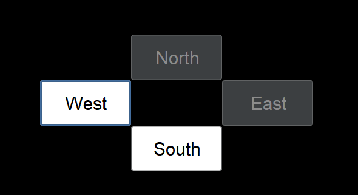

# Results of Testing

The test results show the actual outcome of the testing, following the [Test Plan](test-plan.md)

---

## Movement

User should be able to access every room, and be able to get to the exit

### Test Data Used

Using a screenshot of the exit

### Test Result

The exit is accessible
---

## Invalid Movements

User is not able to move into rooms that have no access, the buttons are greyed out

### Screenshot

The screenshot shows the areas that the player is not able to go to avoid invalid moves.

### Test Result

The screenshot here shows 2 greyed out directions that are invalid moves, so does not let the user
move in those directions but will allow them to use the white direction buttons to navigate

---

